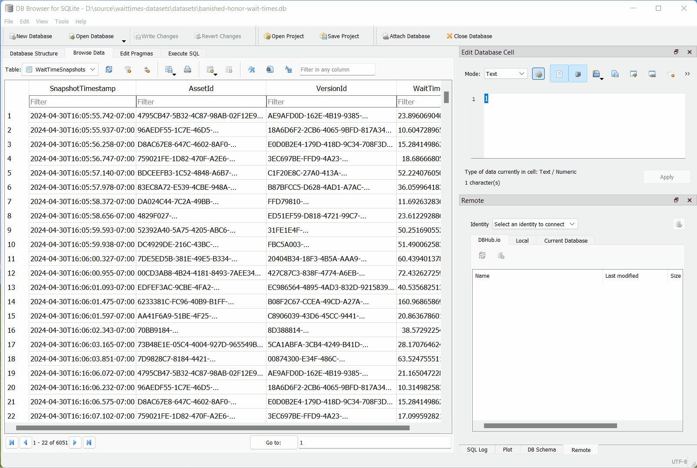

	 
	 
	

		<picture>
			
		</picture>
		 
	

	<h1>OpenSpartan Wait Times Datasets</h1>
	

		An open-source dataset of Halo Infinite wait times powered by <a href="https://openspartan.com">OpenSpartan</a> tooling.
	

	 

# Overview

This repository contains historical data sets for Halo Infinite match times, as captured from the **United States west coast**.

While the data is not necessarily capturing the _global_ wait times, it can be used as a reasonable reference point for wait times for various playlists available through each of the Halo Infinite operations since the start of tracking on the OpenSpartan side.

## Datasets

| 🎖️ Event/Operation | 📆 Timeframe                     | 📦 Dataset                  | 📝 Notes                                                               |
|:------------------------------------------------------------------------------------|:------------------------------------|:------------------------------------------------------------------------|:----------------------------------------------------------------------|
| [Banished Honor](https://www.halowaypoint.com/news/banished-honor-operation-launch) | April 30, 2024 - June 4, 2024       | [`banished-honor-wait-times.db`](datasets/banished-honor-wait-times.db) | ✅ Data has a few gaps as data collection tool issues were addressed. |
| [Tenrai IV](https://www.halowaypoint.com/news/tenrai-iv-operation-launch)           | June 4, 2024 - July 2, 2024         | [`tenrai-iv-wait-times.db`](datasets/tenrai-iv-wait-times.db)           | ✅ Data has a few gaps as data collection tool issues were addressed. |
| [Anvil](https://www.halowaypoint.com/news/anvil-operation-launch)                   | July 2, 2024 - July 30, 2024        | [`anvil-wait-times.db`](datasets/anvil-wait-times.db)                   | ✅ Data collection complete. Minimal gaps.                            |
| [Fleetcom](https://www.halowaypoint.com/news/fleetcom-operation-launch)             | July 30, 2024 - September 3, 2024   | [`fleetcom-wait-times.db`](datasets/fleetcom-wait-times.db) 			  | ✅ Data collection complete. Minimal gaps.							  |
| [Champions](https://www.youtube.com/watch?v=AOjtUrRlxBQ)                            | September 3, 2024 - October 8, 2024 | [`champions-wait-times.db`](datasets/champions-wait-times.db)			  | ✅ Data collection complete. Minimal gaps.  	                      |
| [Haloween](https://www.halowaypoint.com/news/haloween-horrors)                      | October 8, 2024 - November 5, 2024  | [`haloween-wait-times.db`](datasets/haloween-wait-times.db)             | ✅ Data collection complete. Minimal gaps.             	              |
| [Great Journey](https://www.halowaypoint.com/news/great-journey-operation-launch)   | November 5, 2024 - December 2, 2024 | [`great-journey-wait-times.db`](datasets/great-journey-wait-times.db)   | ✅ Data collection complete. Minimal gaps.                            |
| [Snowbound](https://www.halowaypoint.com/news/snowbound-operation-launch)           | December 2, 2024 - January 7, 2025  | [`snowbound-wait-times.db`](datasets/snowbound-wait-times.db)           | ✅ Data collection complete. Minimal gaps.                            |
| [Brute Force](https://www.halowaypoint.com/news/brute-force-operation-launch)       | January 7, 2025 - February 4, 2025  | [`brute-force-wait-times.db`](datasets/brute-foce-wait-times.db)        | ✅ Data collection complete. Minimal gaps.                            |
| [Frontlines](https://www.halowaypoint.com/news/frontlines-operation-launch)         | February 4, 2025 - March 11, 2025   | [`frontlines-wait-times.db`](datasets/frontlines-wait-times.db)         | ✅ Data collection complete. Minimal gaps.                            |
| [Blue Team](https://www.halowaypoint.com/news/blue-team-operation-launch)           | March 11, 2025 - April 8, 2025      | [`blue-team-wait-times.db`](datasets/blue-team-wait-times.db)           | ✅ Data collection complete. Minimal gaps.                            |
| [Forerunner](https://www.halowaypoint.com/news/forerunner-operation-launch)         | April 8, 2025 - May 6, 2025         | [`forerunner-wait-times.db`](datasets/forerunner-wait-times.db)         | ✅ Data collection complete. Minimal gaps.                            |
| [Last Stand](https://www.halowaypoint.com/news/summer-update-2025-halo-infinite)    | May 6, 2025 - June 10, 2025         | `last-stand-wait-times.db`                                              | 🐜 Data collection in progress. See `dev` branch.                     |

## Analyzing the data

Every single dataset available in this repository is a [SQLite database](https://www.sqlite.org/). You can query it from any language or framework that supports SQLite, and even make pretty graphs with [Jupyter notebooks](https://jupyter.org/) and [Python](https://www.python.org/).

There are two tables in each datasets:

| Table | Description |
|:------|:------------|
| `PlaylistMetadata`  | Outlines all playlist-related metadata, including playlist asset ID, version ID, name, description, and more. |
| `WaitTimeSnapshots` | Captures playlist wait times, in 10 minute intervals. Data includes snapshot timestamp (PT time zone), asset ID, version ID, and wait time in seconds. |

You can also analyze the data with the help of a tool like [DB Browser for SQLite](https://sqlitebrowser.org/).

## FAQ

### I see that some data is missing in the Banished Honor and Tenrai IV datasets. What's up with that?

During the data capture I was still stabilizing the tool against issues that resulted in data misses. That resulted in some gaps. Moving forward (starting with the Anvil operation), those gaps should be minimal (if any) and contain the full spectrum of data in 10 minute intervals.

### Can you share the tool that captured this data?

Planning on doing this in the future. For the time being, you can familiarize yourself with the process [on my blog](https://den.dev/blog/halo-infinite-playlist-wait-time-api/).

### Can I use this data to render wait time graphs?

Yes. What I have here is the raw data - you can use it to slice and dice the metrics as you see fit.

### Data is captured for the US west coast. Do you have plans for capturing metrics for other time zones or regions?

I am currently looking at the best ways to capture this data for other regions, but if the changes are going to be happening, it will be _after_ Anvil. The Anvil data set will contain only PT data captures.

## Other tools

- [OpenSpartan Workshop](https://openspartan.com/docs/workshop/guides/get-started/)
- [OpenSpartan XUID Resolver](https://github.com/OpenSpartan/xuid-resolver)
- [OpenSpartan Career Rank Extractor](https://github.com/OpenSpartan/career)

To see the latest on supported tools and data, refer to the [official OpenSpartan site](https://openspartan.com) and [my blog](https://den.dev/tags/halo-api/).
